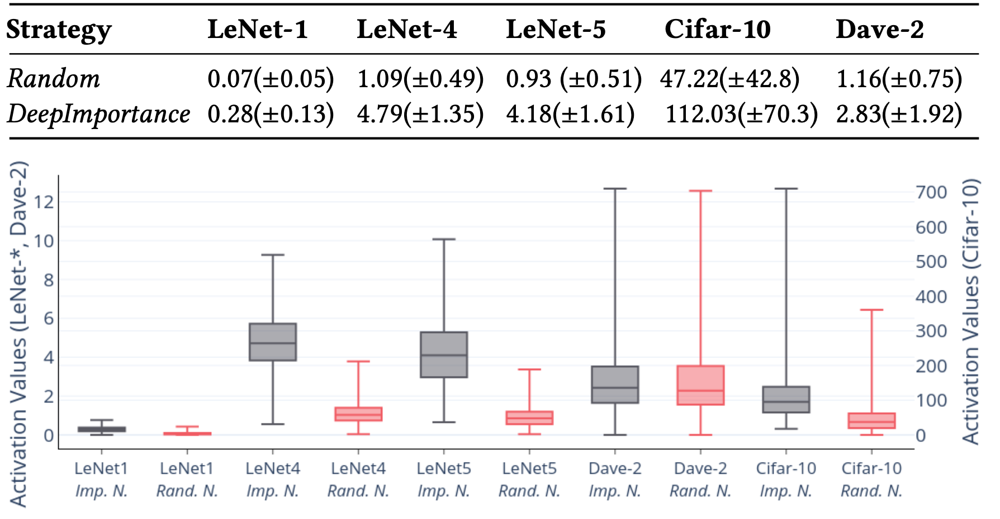

# Importance Driven Coverage of Deep Learning Systems
Deep Learning (DL) systems are key enablers for engineering intelligent applications due to their ability to solve complex tasks such as image recognition and machine translation.
Nevertheless, using DL systems in safety- and security-critical applications requires to provide testing evidence for their dependable operation.
Recent research in this direction focuses on adapting testing criteria from traditional software engineering as a means of increasing confidence for their correct behaviour.
However, they are inadequate in capturing the intrinsic properties exhibited by these systems. We bridge this gap by introducing DeepImportance, a systematic testing methodology accompanied by an _Importance-Driven_ (IDC) test adequacy criterion for DL systems.
Applying IDC enables to establish a _layer-wise functional understanding_ of the importance of DL system components  and use this information to guide the generation of _semantically-diverse_ test sets.
Our empirical evaluation on several DL systems, across multiple DL datasets and with state-of-the-art adversarial generation techniques demonstrates the usefulness and effectiveness of DeepImportance and its ability to guide the engineering of more robust DL systems.


## Overview


Using a pre-trained DL system, DeepImportance analyses the training set
_T_ to establish a fundamental understanding of the overall contribution made by internal neurons of the DL system. This enables to identify the most important neurons that are core contributors to the decision-making process. Then, DeepImportance carries out a quantisation step which produces an
automatically-determined finite set of clusters of neuron activation values that characterises, to a sufficient level, how the behaviour of the most
important neurons changes with respect to inputs from the training set. Finally, DeepImportance uses the produced clusters of the most important neurons to assess the coverage adequacy of the test set. Informally, the
Importance-Driven test adequacy criterion of DeepImportance is satisfied when all combinations of important neurons clusters are exercised.

### Neuron Importance Analysis
The purpose of importance analysis is to identify neurons within a DL system that are key contributors to decision-making. We capitalise on this unique characteristic of neurons within a trained DL system to establish the importance of each neuron. To achieve this, we compute a decomposition of the decision _f(x)_ made by the system for input _x_ ∈ _X_ and use layer-wise _relevance propagation_ [1] to traverse the network graph and redistribute the
decision value in a layer-wise manner proportional to the contribution made by each neuron within the layer. When the relevance propagation is iterated until the input layer, it provides relevance score for each individual raw feature (e.g. pixel, characters etc). Below there are two examples of _relevance propagation_ analysis iterated until the input layer.

The red colored words in the text below represent their high relevance to the classification decision (i.e. cars) of the DNN that is trained for text classification.


The red colored pixels in the image below represent their high relevance to the classification decision (i.e. 6) of the DNN that is trained for handwritten image classification.


### Importance Neuron Clustering
DeepImportance employs _k-means_ to cluster the vector of activation values from the training set for each important neuron and determine sets of values that can be grouped together.

The purpose of clustering is threefold.
* Compared to [2]  which partitions the value range of neuron activation values into _k_ buckets of equal width solely based on a randomly selected number of buckets, the clusters generated by our approach correspond to semantically different features of each neuron.

* Since the range of neuron activation values φ(x,n) could in principle be the entire set of real numbers, the cyclomatic complexity for analysing the DL system is very large. Clustering enables to reduce dimensionality and computational costof testing DL system.

* The identification of clusters for those important neurons informs the allocation of testing resources to ensure that the regions of those neurons are tested sufficiently, thus increasing our confidence for the robust DL system behaviour.

### Importance-Driven Coverage (IDC)
Since important neurons are core contributors in decision-making, it is significant to establish that inputs triggering combinations of activation value clusters of those neurons have been covered adequately. The vector of important neurons cluster combinations (INCC) is given by


Achieving a high IDC score entails a systematically diverse input set that exercises many combinations of important neurons clusters. Consequently, the more confidence we should have in the DL system’s operation. Another important characteristic of IDC is the _layer-wise_ estimation of coverage.

## Implementation
We provide the required information and the source code to reproduce the results presented in the paper. DeepImportance implementation can be found in https://github.com/YYY/DeepImportance. The implementation makes use of Keras(v2.2.2) and Tensorflow(v1.10.1)  libraries. Hyperparameter selection in our evaluation is presented below.

### Hyperparameters Chosen In Evaluation
**CW:**
```
 batch_size=1,
 confidence=0,
 learning_rate=5e-3,
 binary_search_steps=5,
 max_iterations=1000,
 abort_early=True,
 initial_const=1e-2,
 clip_min=0,
 clip_max=1
```

**FGSM:**
```
 eps=0.3,
 ord=np.inf,
 y=None,
 y_target=None,
 clip_min=None,
 clip_max=None,
 clip_grad=False,
 sanity_checks=True,
```

**BIM:**
```
 eps=0.3,
 eps_iter=0.05,
 nb_iter=10,
 y=None,
 ord=np.inf,
 clip_min=None,
 clip_max=None,
 y_target=None,
 rand_init=None,
 rand_init_eps=None,
 clip_grad=False
```

**JSMA:**
```
 theta=1,
 gamma=1,
 clip_min=0,
 clip_max=1,
 y_target=None,
 symbolic_impl=True
```

**Training Parameters for LeNet Models:**
```
loss = 'categorical_crossentropy'
optimizer = 'adadelta'  --> (learning_rate=1.0, rho=0.95)
metrics = ['accuracy']
batch_size = 256,
epochs = 10
```

**Training Parameters for CIFAR Model:**
```
loss = 'categorical_crossentropy'
optimizer = 'RMSprop'  --> (learning_rate=0.0001, decay=1e-6)
metrics = ['accuracy']
batch_size = 32,
epochs = 40
```

**Training Parameters for DAVE Model:**
```
loss = 'mse'
optimizer = 'adadelta'  --> (learning_rate=1.0, rho=0.95)
batch_size = 256,
epochs = 10
```


## Evaluation

### Research Questions
Our experimental evaluation answers the research questions below.

**RQ1 (Importance)**: _Can neuron-importance analysis identify the most important neurons?_

We used this research question to establish if the importance-based algorithm underpinning DeepImportance for the identification of important neurons comfortably outperforms a strategy that selects such neurons randomly.

**RQ2 (Diversity)**: _Can DeepImportance inform the selection of a diverse test set?_

We investigate whether software engineers an employ the IDC to generate a diverse test set that comprises semantically different test inputs.

**RQ3 (Effectiveness)**: _How effective is DeepImportance in identifying misbehaviours in DL systems?_

With this research question, we examine the effectiveness of DeepImportance to detect adversarial inputs carefully crafted by state-of-the-art adversar-
ial generation techniques.

**RQ4 (Correlation)**: _How is DeepImportance correlated with existing coverage criteria for DL systems?_

We analyse the relationship in behaviour between DeepImportance and state-of-the-art coverage criteria for DL systems.

**RQ5 (Layer Sensitivity)**: _How is the behaviour of DeepImportance affected by the selection of specific neuron layers?_

Given the layer-wise capability of DeepImportance, we investigate whether performing the analysis on shallow or deeper layers has any impact on IDC.

**RQ6 (Robustness)** _Can DeepImportance be used to enhance a DNN against inputs whose important features are missing?_

IDC requires semantically diverse inputs to be satisfied. We examine if a DNN can be enhanced by augmenting its training set with the inputs that are increasing IDC.

###  Importance


###  Diversity


###  Effectiveness and Correlation


###  Layer Sensitivity


### Robustness

